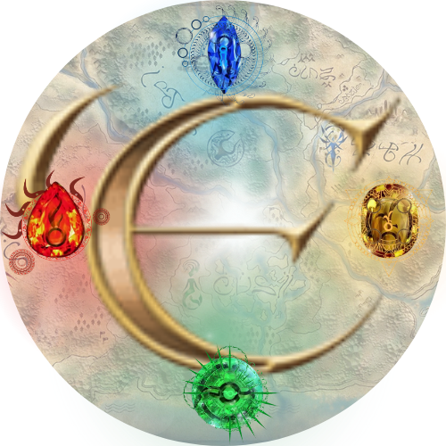

# WDProjLithiumBinadayRivera
## Eteka Aneya Ivi : Reliving the Realm of 2016 Encantadia
******
### Logo:
#### 

### Description:
> **“Eteka Aneya Ivi” which translates to “Have you forgotten?” is a website developed by Binaday, Aliya Louise and Rivera, Brianna Aliah to relive the memories of Encantadia’s prime year—2016.** Encantadia is an original Filipino fantasy series produced by GMA, telling the story of four Sang'gres and their journey towards safekeeping of their land. It is a spin-off of the hit Encantadia show that aired in 2005. Many Filipino genZs, including us, grew up on this show—with echoes of laughter, tears, and anger that influenced our imaginations. **Through this website, we will deep dive into the history, lore, characters, and enchanta words.** This is to honor the memories that they have provided several Filipino kids with. They built our childhood, so it is now time for us to build something to appreciate the beauty of our own Philippine craft. **Ivo Live, alaala ng Encantadia!** *(Long live the memory of Encantadia)*
******
### Webpage Breakdown:
* **Avoya: A voyage.** This is the *homepage*. It will showcase *the map, logo, elements, and navigation to other webpages.*
* **Yanarteya: The past.** It will contain the *website description and the history of Encantadia*—from 2005 to 2016 with a glimpse of the on-going chronicles. Here, pictures, videos, and context will be provided.
* **Serse Bua: Vision.** From the conflict to the resolutions—this webpage tackles *all the lore of 2016 Encantadia.*
* **Gajad: Natives.** In this webpage, the *original and notable characters* of the 2016 series, along with their abilities and powers, will be tackled. It will include an interactive family tree of the the sang'gres wherein when you hover over their photos, the description will pop up.
* **Enchanta: The language.** A break down of the Encantadia language. This will serve as a *dictionary*.
* **Ade: You.** An *interactive quiz* that will determine which kingdom you belong in.
* **Sanggunian: Sources.** This will contain all the *sources* used for the project.
******
### Other Notes:
- This website is dedicated to the **2016 Encantadia Version**. Although a glimpse of the very past (2005) and present (2025) series will be mentioned, this is centered on the 2016 version.
- The link to Sanggunian will be placed along the footnote area.
******
### JS Incorporation
* We will be using JS in the 6th webpage which is titled Ade aka Ikaw. It is an interactive quiz that determines which land does the person belong in. It is similiar to the "Which Hogwarts House Are You?" quiz, but this time, the choices are Lireo, Adamya, Hatoria, and Sapiro (main kingdoms).
******
### Wireframes:
#### Avoya (Home Page):
#### 
#### Yanarteya (P1)
#### 
#### Serse Bua (P2)
#### 
#### Gajad (P3)
#### 
#### Enchanta (P4)
#### 
#### Ade (P5)
#### 
#### Sanggunian
#### 
