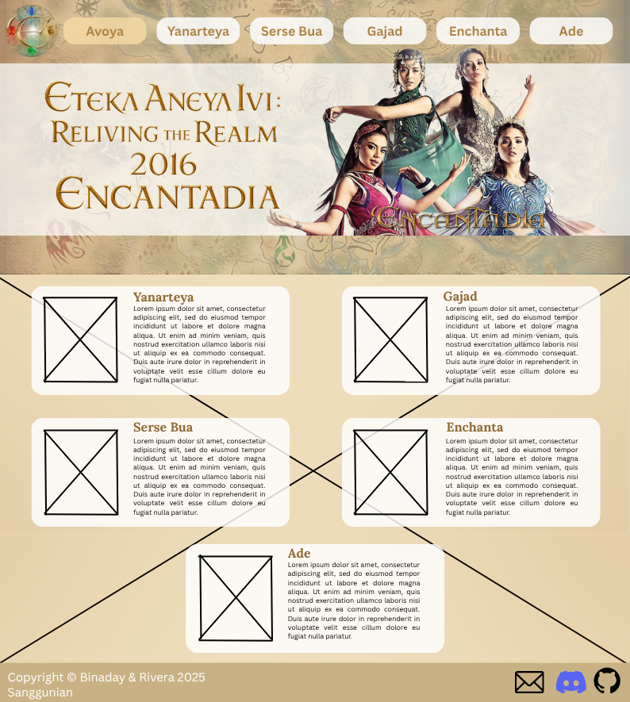
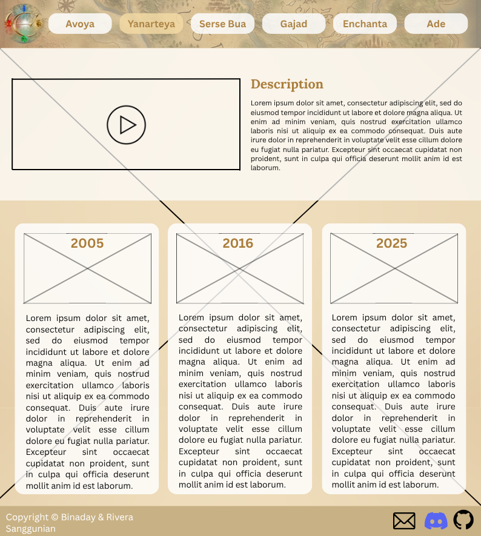

# WDProjLithiumBinadayRivera
## Eteka Aneya Ivi
#### Reliving the Realm of 2016 Encantadia
******
### Logo:
#### 

### Description:
> **“Eteka Aneya Ivi” which translates to “Have you forgotten?” is a website developed by Binaday, Aliya Louise and Rivera, Brianna Aliah to relive the memories of Encantadia’s prime year—2016.** Encantadia is an original Filipino fantasy series produced by GMA, telling the story of four Sang'gres and their journey towards safekeeping of their land. It is a spin-off of the hit Encantadia show that aired in 2005. Many Filipino genZs, including us, grew up on this show—with echoes of laughter, tears, and anger that influenced our imaginations. **Through this website, we will deep dive into the history, lore, characters, and enchanta words.** This is to honor the memories that they have provided several Filipino kids with. They built our childhood, so it is now time for us to build something to appreciate the beauty of our own Philippine craft. **Ivo Live, alaala ng Encantadia!** *(Long live the memory of Encantadia)*
******
### Webpage Breakdown:
* **Avoya: A voyage.** This is the *homepage*. It will showcase *the map, logo, elements, and navigation to other webpages.*
* **Yanarteya: The past.** It will contain the *website description and the history of Encantadia*—from 2005 to 2016 with a glimpse of the on-going chronicles. Here, pictures, videos, and context will be provided.
* **Serse Bua: Vision.** From the conflict to the resolutions—this webpage tackles *all the lore of 2016 Encantadia.*
* **Gajad: Natives.** In this webpage, the *original and notable characters* of the 2016 series, along with their abilities and powers, will be tackled. It will include an interactive family tree of the the sang'gres wherein when you hover over their photos, the description will pop up.
* **Enchanta: The language.** A break down of the Encantadia language. This will serve as a *dictionary*.
* **Ade: You.** An *interactive quiz* that will determine which kingdom you belong in.
* **Sanggunian: Sources.** This will contain all the *sources* used for the project.
******
### Other Notes:
- This website is dedicated to the **2016 Encantadia Version**. Although a glimpse of the very past (2005) and present (2025) series will be mentioned, this is centered on the 2016 version.
- The link to Sanggunian will be placed along the footnote area.
******
### JS Incorporation
* We will be using JS in the 6th webpage which is titled Ade aka Ikaw. It is an interactive quiz that determines which land does the person belong in. It is similiar to the "Which Hogwarts House Are You?" quiz, but this time, the choices are Lireo, Adamya, Hatoria, and Sapiro (main kingdoms).
******
### Wireframes:
[Wireframes](https://www.canva.com/design/DAG3F6QYVfE/8cudTpAn4JjRwmwoI6iNuQ/edit?utm_content=DAG3F6QYVfE&utm_campaign=designshare&utm_medium=link2&utm_source=sharebutton)
#### Avoya (Home Page):
#### 
#### Yanarteya (P1)
#### 
#### Serse Bua (P2)
#### 
#### Gajad(1) (P3)
#### .png)
#### Gajad(2) (P3)
#### .png)
#### Enchanta (P4)
#### 
#### Ade (P5)
#### 
#### Sanggunian
#### 
******

# Q3 Project Poposal Update Plan
### HTML Form:
The website requires users to create an account using an HTML sign-up form in order to access its exclusive content. Account creation allows the site to personalize the user experience and save user-specific data such as preferences and progress.

During registration, users are asked to choose their favorite 2016 Sang’gre. After successfully creating an account and logging in for the first time, the user is redirected to a personalized welcome page featuring their chosen Sang’gre. This page is designed as a one-time exclusive experience and will no longer be accessible on future logins. 

Registered users also gain access to the Enchanta Language Quiz, which is divided into three difficulty levels: Easy, Medium, and Hard. Because the quiz is linked to the user’s account, progress and scores are saved, allowing users to continue where they left off or retake any level at any time
******
### Webpage Breakdown:
* **Create Account**: Allows the user to create an account and immerse themselves into an experience made just for them. By choosing which Sang’gre fits their character and preferences, a one-time character lore will pop up. If ever provided with more time, this sign up will also determine the whole color scheme of the website.

     - Sang’gre Pirena: A character lore specific to Sang’gre Pirena, the host of the fire gem. 

     - Sang’gre Amihan: A character lore specific to Sang’gre Amihan, the host of the air gem. 

     - Sang’gre Alena: A character lore specific to Sang’gre Alena, the host of the water gem. 

     - Sang’gre Danaya: A character lore specific to Sang’gre Danaya, the host of the earth gem. 

* **Log In**: Allows the user to come back to their account — saving their progress for the enchanta quiz.

* **Avoya**: The homepage. The new outline houses a continuous design wherein every scroll shows you a new aspect of the webpage. 

     - 1st Part: Contains animation and acts as the welcoming message.
     - 2nd Part: Contains animations as well and acts as the introduction to the main brilyantes.
     - 3rd Part: Main navigation to the other webpages.

* **Yanarteya**: It will contain the website description and the history of Encantadia—from 2005 to 2016 with a glimpse of the on-going chronicles. Here, pictures, videos, and context will be provided.

* **Serse Bua**: Vision. This webpage tackles all the lore of 2016 encantadia. The new design includes another continuous webpage style. There are five sub-pages, each with their own topics. 

* **Gajad**: Natives. Original and notable 2016 characters are introduced here. The new design changes the family tree idea to a hover card design. 

     - When you go to the webpage, several cards with photos of characters will show up. Once you hover over these cards, simple lores and character origin will show. You can also choose to view them by four categories:          All of them, Bathalas only, Royalty only, and Side Characters only. 

* **Enchanta**: The language. This is Encantadia’s dictionary. A new addition to this webpage is the Enchanta quiz whose progress is noted by the log-in feature. 

     - This is also a continuous webpage wherein the first page asks wherein the first sub-page asks the user if they plan to take the easy, medium, or hard difficulty. The second one is the main quiz while the third one         is the summary of the entire quiz taken.

* **Sanggunian**: Contains all the sources of the website
*****
### Updated Wireframes:
[Wireframes](https://www.canva.com/design/DAG9u0QO_z8/k44gLPl9cvsCLM--HbEZag/edit?utm_content=DAG9u0QO_z8&utm_campaign=designshare&utm_medium=link2&utm_source=sharebutton)
