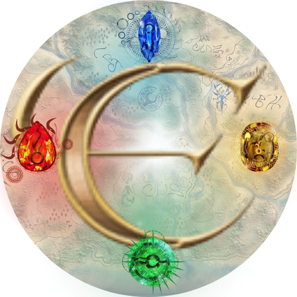
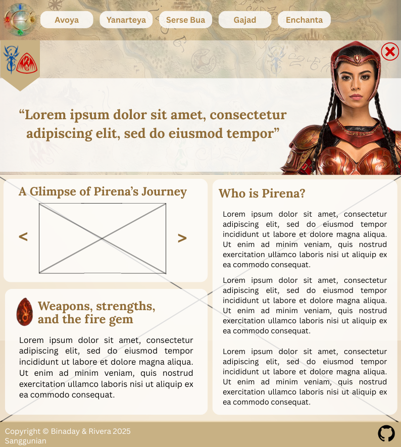
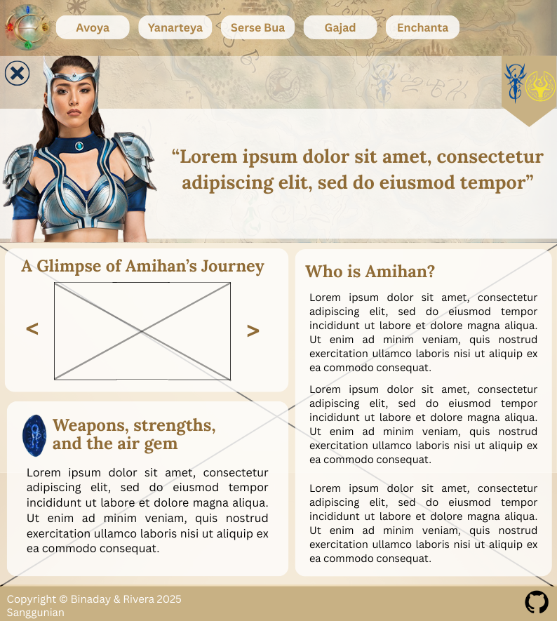
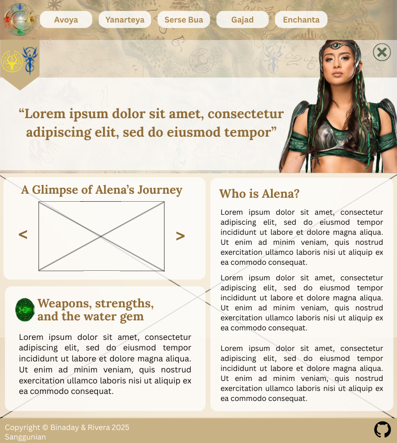
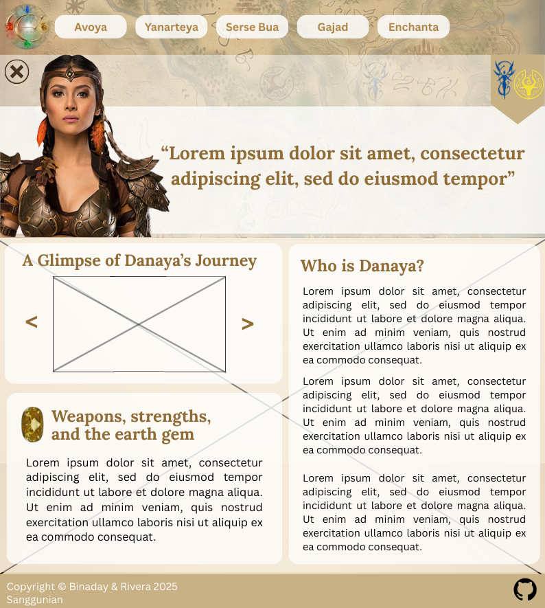

# WDProjLithiumBinadayRivera
## Eteka Aneya Ivi
#### Reliving the Realm of 2016 Encantadia
******
### Logo:
#### 

### Description:
> **“Eteka Aneya Ivi” which translates to “Have you forgotten?” is a website developed by Binaday, Aliya Louise and Rivera, Brianna Aliah to relive the memories of Encantadia’s prime year—2016.** Encantadia is an original Filipino fantasy series produced by GMA, telling the story of four Sang'gres and their journey towards safekeeping of their land. It is a spin-off of the hit Encantadia show that aired in 2005. Many Filipino genZs, including us, grew up on this show—with echoes of laughter, tears, and anger that influenced our imaginations. **Through this website, we will deep dive into the history, lore, characters, and enchanta words.** This is to honor the memories that they have provided several Filipino kids with. They built our childhood, so it is now time for us to build something to appreciate the beauty of our own Philippine craft. **Ivo Live, alaala ng Encantadia!** *(Long live the memory of Encantadia)*
******
### Final Modification Proposal:
For the final project, we will be implementing update and delete through the following: updating of themes, and creating a profile page which will allow the user to delete their accounts. Last quarter, we have already implemented this update factor wherein the code reads the score and saves it so that the user can change the website theme to their preferred. For instance, if they acquired 10 points and choose to buy the “Etheria Theme” then the website will be updated such that the whole color scheme and background will change. 

Since we already started, for the update factor of the final project we will be including the pages that we weren’t able to include before due to time constraints. The following webpages will be included in this update: Avoya, Sanggunian, Sign Up, and the newly added webpage that is to be discussed further in this narrative, Profile. If possible, we will also create more themes depending on the Sang’gre they chose during Sign Up. However, our main priority is really to make sure that all webpages will be updated, and all themes will be aesthetically pleasing to the eyes. This means that all dark-colored themes will be updated to make the colors compliment each other better. The purpose of our theme update information is to maximize user entertainment and engagement. In order to get the points, they have to learn Enchanta, answer the quiz, and accumulate the number of points needed. This keeps them engaged, and be more present with the magical realm. And in order for us to keep them entertained and happy while doing so, we need to make sure that the updated themes will be  worthwhile.

Moving on, in order for us to implement delete we will create a new webpage: Profile. A new navigation tab will be added in the header labeled as “Profile.” Once clicked, it will bring the user to their profile with their information such as name, password, chosen Sang’gre, and current points. Below the information, there will be a button that will allow the user to delete their accounts. Once they click delete, a pop-up will appear asking if they are sure about their decision. If they do end up clicking yes then all information will be deleted from the local storage. Why would one need a delete button? Many different reasons, but some may delete simply because they grew out of it, and that is normal. The website is so that we could reminisce on the joy Encantadia 2016 gave us, but some may get tired of it, hence the delete button. 

### Final Modification Wireframes:
[Q4 Wireframes](https://www.canva.com/design/DAHDZ09l1qs/IGmjmdVDn0kqQ0Hyceaj8w/edit?utm_content=DAHDZ09l1qs&utm_campaign=designshare&utm_medium=link2&utm_source=sharebutton)

******
### Webpage Breakdown:
* **Create Account**: Allows the user to create an account and immerse themselves into an experience made just for them. By choosing which Sang’gre fits their character and preferences, a one-time character lore will pop up. If ever provided with more time, this sign up will also determine the whole color scheme of the website.

     - Sang’gre Pirena: A character lore specific to Sang’gre Pirena, the host of the fire gem. 

     - Sang’gre Amihan: A character lore specific to Sang’gre Amihan, the host of the air gem. 

     - Sang’gre Alena: A character lore specific to Sang’gre Alena, the host of the water gem. 

     - Sang’gre Danaya: A character lore specific to Sang’gre Danaya, the host of the earth gem. 

* **Log In**: Allows the user to come back to their account — saving their progress for the enchanta quiz. Log-in also saves the theme picked from the sign up or the themes acquired from answering the enchanta quiz.
* **Profile**: This will contain an HTML form which allows the user to customize and input/edit their information. The HTML form will contain the user's Email, Bio/About me, Username, Favorite Kingdom and Password. The user's inputs will be saved using the 'Save Changes' button and the account can also be deleted using the 'Delete Profile' button
* **Avoya: A voyage.** This is the *homepage*. It will showcase *the map, logo, elements, and navigation to other webpages.*
- 1st Part: Contains animation and acts as the welcoming message.
- 2nd Part: Contains animations as well and acts as the introduction to the main brilyantes.
- 3rd Part: Main navigation to the other webpages.
* **Yanarteya: The past.** It will contain the *website description and the history of Encantadia*—from 2005 to 2016 with a glimpse of the on-going chronicles. Here, pictures, videos, and context will be provided.
* **Serse Bua: Vision.** From the conflict to the resolutions—this webpage tackles *all the lore of 2016 Encantadia.* There are five sub-pages, each with their own topics. 
* **Gajad: Natives.** In this webpage, the *original and notable characters* of the 2016 series, along with their abilities and powers, will be tackled.
- When you go to the webpage, several cards with photos of characters will show up. Once you hover over these cards, simple lores and character origin will show. You can also choose to view them by four categories:All of them, Bathalas only, Royalty only, and Side Characters only. 
* **Enchanta: The language.** A break down of the Encantadia language. This will serve as a *dictionary*. An addition to this webpage is the Enchanta quiz wherein the progress is accounted by the log-in feature. The points obtained from answering the quiz can be used to acquire more themes.
- This is also a continuous webpage wherein the first sub-page asks the user if they plan to take the easy, medium, or hard quiz difficulty. The second one is the main quiz while the third is the summary of the              entire quiz taken.
* **Sanggunian: Sources.** This will contain all the *sources* used for the project.
******
### Wireframes:
[Q2 Wireframes](https://www.canva.com/design/DAG3F6QYVfE/8cudTpAn4JjRwmwoI6iNuQ/edit?utm_content=DAG3F6QYVfE&utm_campaign=designshare&utm_medium=link2&utm_source=sharebutton)
[Q3 Wireframes](https://www.canva.com/design/DAG9u0QO_z8/k44gLPl9cvsCLM--HbEZag/edit?utm_content=DAG9u0QO_z8&utm_campaign=designshare&utm_medium=link2&utm_source=sharebutton)
#### Create Account
#### Create_Account.png),
#### Sang'gre Pirena
#### 
#### Sang'gre Amihan
#### 
#### Sang'gre Alena
#### 
#### Sang'gre Danaya
#### 
#### Log In
#### Log_In.png)
#### Avoya (Home Page)
#### Avoya.png)
#### Yanarteya
#### Yanarteya.png)
#### Serse Bua
#### Serse_Bua.png)
#### Gajad(1)
#### Gajad(1).png)
#### Gajad(2)
#### Gajad(2).png)
#### Enchanta(1)
#### (Updated)Enchanta.png)
#### Enchanta(2)
#### (Updated)Enchanta.png)
#### Sanggunian
#### Sanggunian.png)
******
### Other Notes:
- This website is dedicated to the **2016 Encantadia Version**. Although a glimpse of the very past (2005) and present (2025) series will be mentioned, this is centered on the 2016 version.
- The link to Sanggunian will be placed along the footnote area.
******
### JS Incorporation
* We will be using JS in the 6th webpage which is titled Ade aka Ikaw. It is an interactive quiz that determines which land does the person belong in. It is similiar to the "Which Hogwarts House Are You?" quiz, but this time, the choices are Lireo, Adamya, Hatoria, and Sapiro (main kingdoms).
******
# Q3 Project Poposal Update Plan
### HTML Form:
The website requires users to create an account using an HTML sign-up form in order to access its exclusive content. Account creation allows the site to personalize the user experience and save user-specific data such as preferences and progress.

During registration, users are asked to choose their favorite 2016 Sang’gre. After successfully creating an account and logging in for the first time, the user is redirected to a personalized welcome page featuring their chosen Sang’gre. This page is designed as a one-time exclusive experience and will no longer be accessible on future logins. 

Registered users also gain access to the Enchanta Language Quiz, which is divided into three difficulty levels: Easy, Medium, and Hard. Because the quiz is linked to the user’s account, progress and scores are saved, allowing users to continue where they left off or retake any level at any time
